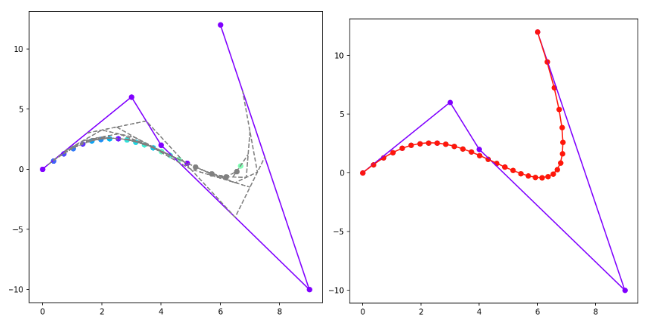
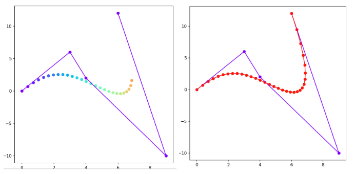

# Tugas Kecil 2 IF2211 Strategi Algoritma

> Aproksimasi Kurva Bezier dengan pendekatan algoritma Divide and Conquer.

## Table of Contents

- [General Info](#general-information)
- [Technologies Used](#technologies-used)
- [Features](#features)
- [Screenshots](#screenshots)
- [Setup](#setup)
- [Usage](#usage)
- [Project Status](#project-status)
- [Room for Improvement](#room-for-improvement)
- [Acknowledgements](#acknowledgements)
- [Creator](#creator)

## General Information

Kurva Bezier adalah kurva yang sangat sering digunakan dalam desain grafis, animasi, dan desain rekayasa. Kurva ini dibuat dengan menetapkan beberapa titik kontrol yang menentukan arah dan lengkungan kurva. Kurva berawal dari titik kontrol pertama dan bergerak melengkung mengikuti arah posisi relatif titik kontrol lain (walaupun tidak tepat mengenai titik kontrol), sebelum akhirnya berhenti tepat pada titik kontrol terakhir.

Pada Tugas Kecil 2 ini, program dirancang dengan menerapkan algoritma Divide and Conquer yang telah dipelajari di kelas untuk melakukan aproksimasi hasil kurva bezier. Program juga memiliki opsi untuk melakukan aproksimasi menggunakan algoritma brute force, sehingga dapat dibandingkan antara proses perhitungan secara brute force dengan secara divide and conquer serta waktu eksekusi masing-masing.

## Technologies Used

- Python - version 3.12
- matplotlib - version 3.8.3
- numpy - version 1.26

## Features

- Melakukan visualisasi aproksimasi kurva menggunakan pendekatan divide and conquer
- Melakukan visualisasi aproksimasi kurva menggunakan pendekatan brute force

## Screenshots

## Setup

1. Clone repository ini dengan perintah `git clone https://github.com/IrfanSidiq/Tucil2_13522007.git`
2. Bila belum melakukan instalasi numpy dan/atau matplotlib, lakukan instalasi dengan perintah `pip install numpy` dan/atau
   `pip install matplotlib`

## Usage

1. Pindah current folder ke folder `src`
2. Untuk menjalankan program, ketik command berikut pada terminal: `python main.py` atau `python3 main.py`

## Project Status

Project is: _complete_

## Room for Improvement

Pengembangan kedepannya dapat dilakukan dengan menambahkan fitur berikut:

- Menambahkan fitur GUI untuk input data
- Melakukan visualisasi titik pada ruang 3 dimensi

## Acknowledgements

Ucapan terima kasih diberikan kepada:
- Pak Rinaldi Munir selaku dosen mata kuliah IF2211 yang telah mengajarkan materi divide and conquer
- Tim Asisten yang telah membimbing untuk membuat tugas kecil 2 ini

## Creator

| NIM      | Nama                |
| -------- | ------------------- |
| 13522007 | Irfan Sidiq Permana |